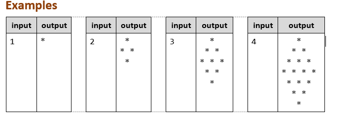
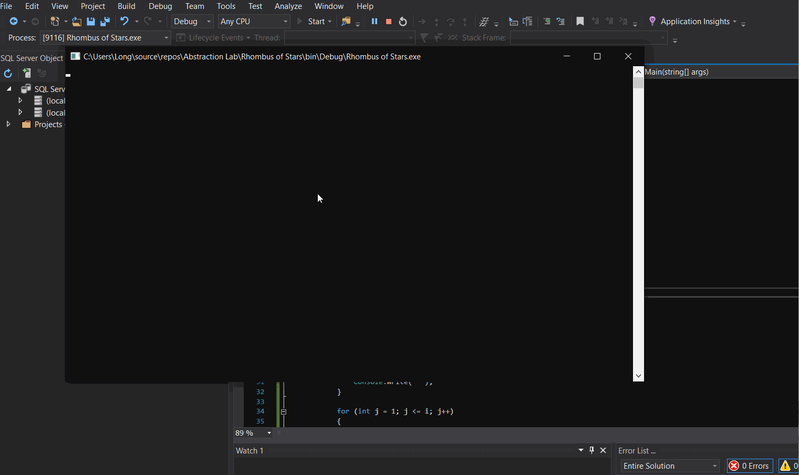
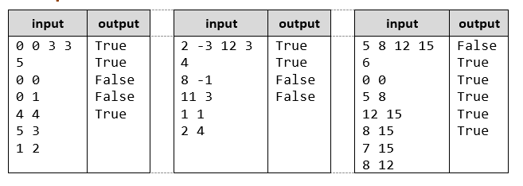
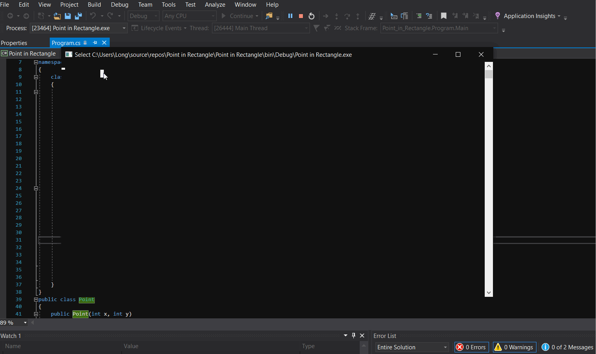

# Abstraction-Lab
## Rhombus of Stars
Create a program that reads a positive integer n as input and prints on the console a rhombus with size n: 
 
### Result
 
## Problem 1. Point in Rectangle  
Create a class Point and a class Rectangle. The Point should hold coordinates X and Y and the Rectangle should hold 2 Points – its top left and bottom right corners. In the Rectangle class, you should implement a Contains(Point point) method that returns true or false, based on whether the Point given as attribute is inside or outside of the Rectangle object. Points on the side of a Square are considered inside. 
### Input 
•	On the first line read the coordinates of the top left and bottom right corner of the Rectangle in the format: “<topLeftX> <topLeftY> <bottomRightX> <bottomRightY>”. 
•	On the second line, read an integer N and on the next N lines, read the coordinates of points.
  Output 
  •	For each point, print out the result of the Contains() method. 

### Example 
 
### Result
</br)
